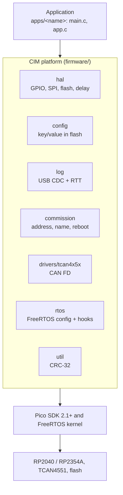
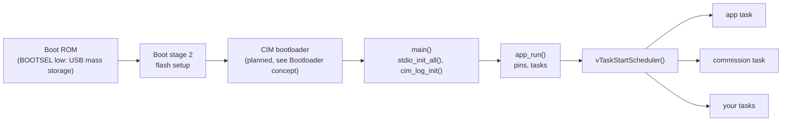
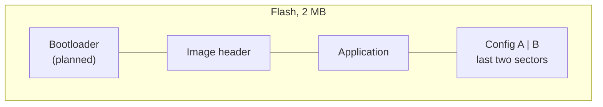

# Firmware architecture

The firmware is a small platform on top of the Raspberry Pi Pico SDK, plus the application that uses it. Everything the platform offers is a `cim_` library with one header under `cim/`; the application is the only part that differs from board to board.

## Modules

| Module | Target | Header | What it does |
|---|---|---|---|
| `hal` | `cim_hal` | `cim/hal.h` | thin wrappers for GPIO, GPIO interrupts, SPI, flash and delays; the only place that touches SDK hardware APIs directly |
| `util` | `cim_util` | `cim/crc32.h` | CRC-32, used by the config store and the protocol |
| `config` | `cim_config` | `cim/config.h` | power-safe key/value store in the last two flash sectors ([details](../../firmware/config/README.md)) |
| `log` | `cim_log` | `cim/log.h` | `CIM_LOG_*` macros with levels and tags, output on USB CDC and RTT ([details](../../firmware/log/README.md)) |
| `commission` | `cim_commission` | `cim/commission.h` | line commands over USB serial to set address and name, read the UID, reboot ([details](../../firmware/commission/README.md)) |
| `drivers/tcan4x5x` | `cim_tcan4x5x` | `tcan.h` | CAN FD driver: TI's register layer under `ti/`, CIM's API on top ([details](../../firmware/drivers/tcan4x5x/README.md)) |
| `rtos` | `cim_rtos` | | FreeRTOS kernel as submodule, shared `FreeRTOSConfig.h`, hooks, and a task-friendly `cim_delay_ms()` ([details](../../firmware/rtos/README.md)) |
| `boards` | | `cim_pins.h` | pin definitions shared by both boards, selected with `PICO_BOARD` |

Rules:

- A module lives in `firmware/<module>/` with `include/cim/`, `src/`, a `CMakeLists.txt` that defines `cim_<module>`, and a `README.md` that is part of this site.
- Names are `snake_case` with the `cim_` prefix in the platform and `app_` in applications.
- Modules depend downwards only. Pin-level work (GPIO, SPI, flash, delays) goes through `cim_hal`; the other modules use the Pico SDK only for services such as stdio, time, the unique ID and reboot.
- Third-party code (TI's TCAN4x5x files, the FreeRTOS kernel) is kept unmodified; fixes go into CIM's layer above it, see the [driver README](../../firmware/drivers/tcan4x5x/README.md#rules-for-ti).
- The examples in `firmware/examples/` are bare metal and test one module each. Applications run on FreeRTOS.

## Boot and application flow

`main.c` of an application only starts the platform and calls `app_run()`, which creates the tasks and starts the scheduler; it never returns. The example application keeps one task for the application logic and one that polls commissioning, so a board can be given an address while it runs. See [Writing an application](../../firmware/apps/README.md).

## Concurrency

- FreeRTOS runs on core 0 only by default (`configNUMBER_OF_CORES 1`); core 1 is free. Because of that, flash writes of the config store need to stop interrupts on core 0 only.
- `cim_delay_ms()` blocks the calling task once the scheduler runs and busy-waits before, so drivers wait the same way in examples and applications.
- The TCAN4x5x driver does all SPI traffic in `tcan_poll()`, `tcan_send()` and `tcan_get_status()`; the interrupt line only sets a flag. Call these from one task.
- Logging never blocks: USB CDC drops output without a host, RTT drops lines when its buffer is full.

## Flash layout

Today an application is linked at the start of flash, like any Pico SDK program. The last two 4 KB sectors belong to the [config store](../../firmware/config/README.md); its reads need no initialisation, so the bootloader can use the same node address. The bootloader area and image header come with the [bootloader](../protocol/bootloader.md).

## Build structure

`firmware/cmake/cim_import.cmake` is the one entry point: it adds the board headers, finds the Pico SDK, and provides `cim_init()` and `cim_add_app()`. The repository's own `firmware/CMakeLists.txt` uses it exactly like an external project with CIM as a git submodule, which CI checks with `firmware/tests/consumer`. The board is selected with `PICO_BOARD`; the presets in `CMakePresets.json` set it.

## Relation to the thesis

The thesis architecture had the same split between a user application and a platform, but used McuLib as the abstraction layer with handle-based modules on top of the Pico SDK, and one FreeRTOS task per application. [^thesis-sw] The open-source firmware keeps the split and the task model, and replaces McuLib with the small `cim_` modules above, so the platform has no dependency besides the Pico SDK and the FreeRTOS kernel.

[^thesis-sw]: L. Betschart, *CAN FD Interface Module*, master's thesis, HSLU, 2024. Chapter 5 (Architecture & Design), *Software Architecture*, and chapter 7 (Software Implementation), *C Project Structure*. See [Background](../background.md#the-masters-thesis) for the PDF.
