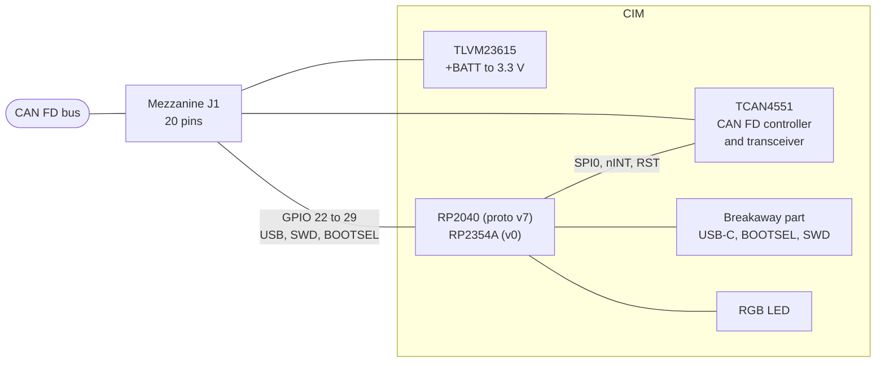

# Hardware overview

CIM is a small 4-layer board that sits as a node on a CAN FD bus and connects the bus to sensors and actuators. The board itself stays the same for every use; the application-specific circuitry and connectors go on a carrier board underneath, joined by a 20-pin mezzanine connector. All signals a carrier needs are on that connector, so the breakaway part with USB-C, BOOTSEL button and SWD pads can be snapped off where space is tight. [^thesis]

## Boards

| Board | MCU | Flash | CAD | `PICO_BOARD` |
|---|---|---|---|---|
| CIM prototype v7 | RP2040 | W25Q16JV, 2 MB external | KiCad | `cim_proto_v7` |
| CIM v0 | RP2354A | 2 MB in package | KiCad | `cim_v0` |

Both boards have the same pinout and the same CAN controller, regulator, LED and connector, so one firmware build differs only in the preset. The design files are in [AMZ-Racing/cim-hardware](https://github.com/AMZ-Racing/cim-hardware) (`cim-pcb-prototype-v7/`, `cim-pcb-v0/`), together with the shared KiCad library and the Raspberry Pi HAT of the [HIL test bench](../hil/README.md).

## Components and why they were chosen

**RP2040 / RP2354A.** The RP2040 was picked for its community support, its wide use at HSLU and because it runs code from an unencrypted external flash, which suits an open-source product. It has no CAN peripheral, so an external controller is needed. CIM v0 moves to the RP2354A, the RP2350 variant with 2 MB of flash in the package, which removes the external flash chip. [^thesis-mcu]

**TCAN4551 CAN FD controller.** Requirements: CAN FD at up to 8 Mbit/s, 3.3 V logic, and availability. A controller with an integrated transceiver was preferred over a separate pair because it is smaller and simpler; galvanic isolation was not required. Microchip's MCP251863 and TI's TCAN4551 both qualified, and the TCAN4551 won on package size (3.3 mm x 4.3 mm VQFN-20). It is controlled over SPI and signals events on an interrupt line. [^thesis-can] The CAN lines pass through a common-mode choke before the connector; the thesis found the original RC filter too strong at 8 Mbit/s, which is why the filter is a point to re-evaluate. [^thesis-filter]

**TLVM23615 regulator.** The board is powered from the car's LV system (21 V to 29.4 V) and must deliver a stable 3.3 V with about 1 A for itself and small peripherals on the carrier. The TLVM23615 is a 1.5 A, 36 V step-down module with integrated inductor and up to 88 % efficiency, in 3.5 mm x 2.0 mm. [^thesis-psu] On the bench, 12 V is enough.

**Clock.** A 12 MHz single-ended CMOS oscillator (Würth WE-SPXO) clocks the MCU, as required by its USB bootloader; the TCAN4551 has its own 40 MHz oscillator. [^thesis-mcu]

**Power over USB.** `+BATT` and USB VBUS are diode-ORed, so a board runs from USB alone for flashing and development. Without `+BATT` the CAN controller reports undervoltage and does not enter normal mode, see [Getting started](../getting-started.md#what-you-need).

**Mezzanine connector.** An Amphenol Bergstak 10132798-021100LF, 20 pins at 0.5 mm pitch, on the bottom side. Its pin assignment follows the must-have list from the thesis: supply, CAN, eight GPIOs of which four have ADC, SWD, 3.3 V out, and USB plus BOOTSEL as nice-to-have. [^thesis-conn] See [Pinout](pinout.md).

## Design history

| Version | Notes |
|---|---|
| Testboard v0 | Raspberry Pi Pico with TCAN4551 and TLVM23615 test circuits, KiCad |
| v1 | first custom RP2040 layout, too big, never produced |
| v2 | first version with the mezzanine connector, never produced |
| v3, v4 | switch to Altium Designer (AMZ's tool); v4 was the first board used in the car |
| v5 | breakaway part added; small fixes on USB and TCAN pull resistors |
| v6 | cleaned-up v5, 0.8 mm board; the version documented in the thesis |
| prototype v7 | back in KiCad, same pinout, basis of the open-source firmware |
| v0 | RP2354A instead of RP2040 plus external flash |

Details and pictures of v0 to v6 are in the thesis, chapter 6 (Hardware Implementation), section *Hardware Design Evolution*. [^thesis-hist]

## Further reading

- [RP2040 datasheet](https://datasheets.raspberrypi.com/rp2040/rp2040-datasheet.pdf) and [RP2350 datasheet](https://datasheets.raspberrypi.com/rp2350/rp2350-datasheet.pdf)
- [TCAN4551-Q1](https://www.ti.com/product/TCAN4551-Q1) product page and datasheet
- [TLVM23615](https://www.ti.com/product/TLVM23615) product page and datasheet
- The thesis, for the full component evaluation, the PCB stack-up, assembly and the measurements (power consumption, ripple, heat, SPI throughput) in chapter 8 (Testing and Validation).

[^thesis]: L. Betschart, *CAN FD Interface Module*, master's thesis, Lucerne University of Applied Sciences and Arts (HSLU), 2024. Chapter 1, *Nomenclature*, and chapter 5 (Architecture & Design), *Hardware Architecture*. The PDF will be added to this documentation.
[^thesis-mcu]: Thesis, chapter 5, *Microcontroller* (with *Clock Source*, *Flash Memory*, *Debug Interface*), and chapter 6 (Hardware Implementation), *Microcontroller RP2040*.
[^thesis-can]: Thesis, chapter 5, *CAN FD Controller*, section *Selection*, and chapter 6, *CAN FD Controller TCAN4551*.
[^thesis-filter]: Thesis, chapter 6, *CAN FD Controller TCAN4551*, section *Filter*.
[^thesis-psu]: Thesis, chapter 5, *Power Supply*, and chapter 6, *Power Supply TLVM23615*.
[^thesis-conn]: Thesis, chapter 5, *Connector*, and chapter 6, *Mezzanine Connector*.
[^thesis-hist]: Thesis, chapter 6, *Hardware Design Evolution*.
