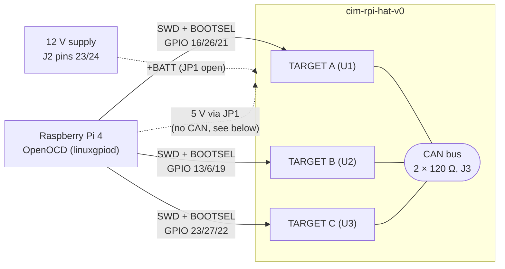

# HIL test bench

The hardware-in-the-loop (HIL) bench runs firmware tests on real CIMs: a Raspberry Pi 4 flashes and debugs up to three CIMs over SWD and talks to them over a shared CAN bus.

> [!WARNING]
> **Open JP1 before connecting 12 V to J2.** JP1 is bridged by default and connects the Pi's 5 V rail to `+BATT`. With JP1 bridged, 12 V on J2 reaches the Pi and destroys it.

## Hardware

- Raspberry Pi 4 (2 GB is enough)
- HAT `cim-rpi-hat-v0` ([cim-hardware](https://github.com/AMZ-Racing/cim-hardware), `cim-rpi-hat-v0/`)
- Up to three CIMs (proto v7) in slots TARGET A, B and C



### Pinout

| Slot | Ref | SWDIO | SWCLK | BOOTSEL | Mezzanine GPIO22–29 |
|---|---|---|---|---|---|
| TARGET A | U1 | GPIO16 | GPIO26 | GPIO21 | not connected |
| TARGET B | U2 | GPIO13 | GPIO6 | GPIO19 | Pi GPIO 5, 7, 8, 11, 25, 9, 10, 24 (incl. Pi SPI0) |
| TARGET C | U3 | GPIO23 | GPIO27 | GPIO22 | header J2 |

All numbers are Pi BCM GPIOs on `gpiochip0`. The CIMs' USB is not routed on the HAT; a CIM can still be connected to a PC with its own USB-C.

When a slot's CIM is powered and idle, its SWDIO, SWCLK and BOOTSEL lines read high (`gpioget -c gpiochip0 16 26 21`). If they read low, the slot is empty or not powered.

### Power

`+BATT` of all slots comes either from J2 pins 23/24 or, through JP1, from the Pi's 5 V.

| Supply | JP1 | Use |
|---|---|---|
| Pi 5 V | bridged (default) | SWD only. The TCAN reports undervoltage (UVSUP) and does not enter Normal mode, so **no CAN**. |
| 12 V on J2 | **open** | Everything, including CAN. |

## Raspberry Pi setup

1. Write **Raspberry Pi OS Lite (64-bit)** with [Raspberry Pi Imager](https://www.raspberrypi.com/software/). In the OS customisation, set:
   - hostname (e.g. `cim-hil`) and user (e.g. `hil`)
   - SSH with public-key authentication only
   - network
2. Boot the Pi **without the HAT** and log in over SSH.
3. Copy [`hil/setup-pi.sh`](../../hil/setup-pi.sh) to the Pi, run it as the HIL user, then reboot:
   ```sh
   scp hil/setup-pi.sh cim-hil:
   ssh -t cim-hil ./setup-pi.sh && ssh cim-hil sudo reboot
   ```
   The script installs git, python3-venv, OpenOCD, gpiod and i2c-tools, adds the user to the `gpio` and `i2c` groups, enables I2C (for the status display) and checks that OpenOCD has the `linuxgpiod` adapter.
4. Switch the Pi off, put the HAT on and the CIMs in. Check the power table above before applying 12 V.

## SWD check

The Raspberry Pi build of OpenOCD drives SWD directly from the Pi's GPIOs. For TARGET B:

```sh
openocd -c "adapter driver linuxgpiod" \
        -c "adapter gpio swclk 6 -chip 0" -c "adapter gpio swdio 13 -chip 0" \
        -c "transport select swd" -f target/rp2040.cfg \
        -c init -c halt -c "reg pc" -c "rp2040.core0 resume" -c shutdown
```

A working slot prints `SWD DPIDR 0x0bc12477` and `Examination succeed` for both cores. `program <file>.elf verify reset exit` flashes a board in about 6 s.

## Known boards

| Board | Status |
|---|---|
| proto v7 with defective hardware divider | **Do not use for tests.** Large divisions return wrong results, see #41. Check any board with the divider test in #41; a good chip prints `q=0x00022e09 r=0x00000001`, the defective one `q=0x00022fff r=0x0000e347`. Mark it physically. |
