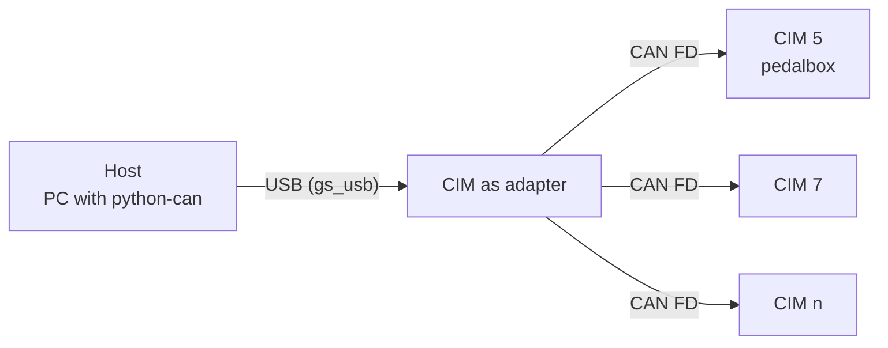
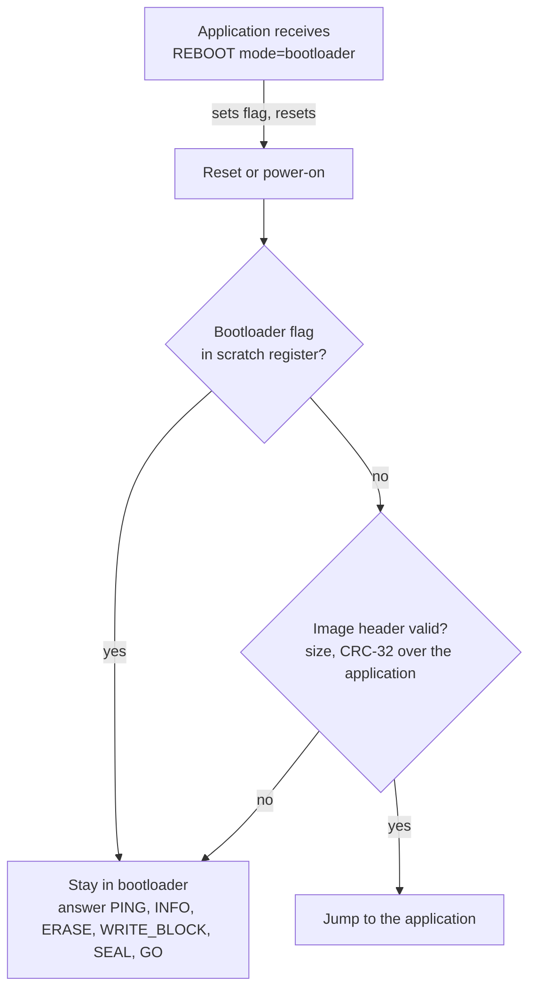
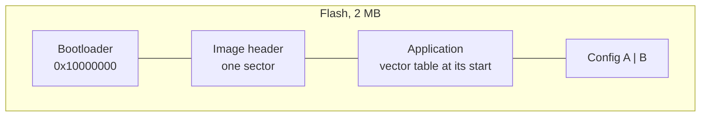

# Bootloader concept

> [!NOTE]
> The CAN FD bootloader is planned for milestone M5 ([#14](https://github.com/bluuas/cim/issues/14), [#15](https://github.com/bluuas/cim/issues/15)). This page describes the concept it will follow: the design from the thesis, updated by [ADR 0002](../adr/0002-device-protocol.md). The frame formats and commands are specified in [CIM protocol](cim-protocol.md).

## Why a bootloader

A car has up to about thirty CIMs in the wire harness, and a USB cable to each of them is not an option. The bootloader lets a host update any CIM over the CAN bus it already sits on, addressed by its node address, and it keeps a board recoverable when an application is broken. [^thesis-bl]

## Who talks to whom

- **Host:** a PC running the tools in `tools/`, which only use python-can. In the thesis the host could also be the car's VCU.
- **Adapter:** a CIM with the adapter firmware, seen by the PC as a gs_usb CAN FD interface ([ADR 0001](../adr/0001-pc-can-link.md)). The thesis called this the *bridge* and used a custom USB protocol for it.
- **Targets:** every CIM on the bus, each with a fixed node address stored in its [configuration](../../firmware/config/README.md). The bootloader reads that address from the same store as the application.

## Boot decision

The bootloader is the first code after the Pico SDK's boot stage 2 and decides within milliseconds whether to start the application.

The application never needs to know the update protocol beyond answering PING and REBOOT. A CIM with no valid application, or with a damaged one, stays in the bootloader and is still reachable. [^thesis-bl] [^adr2]

## Update stages

The stages come from Brian Starkey's [rp2040-serial-bootloader](https://github.com/usedbytes/rp2040-serial-bootloader), carried over to CAN FD in the thesis. [^thesis-bl]

| Stage | Host sends | Target does |
|---|---|---|
| PING | broadcast or to one address | answers with mode (app or bootloader), UID and versions |
| REBOOT | mode = bootloader | answers, sets the flag, resets |
| INFO | | reports application start, maximum size, block size (4 KB) and bootloader version |
| ERASE | offset, length | erases whole sectors, answers when done |
| WRITE_BLOCK | offset, length, CRC-32, then the data frames of one block | collects the block, checks the CRC, programs the flash, reads it back, answers |
| SEAL | size, CRC-32 of the application | verifies the CRC over flash and writes the image header that marks the application valid |
| GO | | starts the application |

The full exchange with timing is in [CIM protocol, section 7](cim-protocol.md#7-example-updating-cim-5).

## Memory layout

The bootloader lives at the start of flash and the application is linked behind it, with an image header in between that holds the application's size and CRC-32. [^thesis-linker] The sizes are set in the linker script and enforced for every application by `cim_add_app()` (#15). The two config sectors at the end of the flash are shared with the application.

The thesis implementation reserved 92 KB for the bootloader and one 4 KB sector for the header. The open-source bootloader aims at a similar budget; the final numbers are fixed with #15.

## What changed since the thesis

Version 1 of the protocol (*CAN Shell*) worked, but it had flaws that showed in the car. [^adr2]

| Thesis (version 1) | Now (version 2) |
|---|---|
| one shared 11-bit ID (0x101) for every request and response | 29-bit IDs carrying frame type, destination and source, separate for requests, responses and data; no collision with the team's DBC |
| 4-byte header with source, destination, command, end flag | header fields in the ID; every response carries a status code |
| silent failures | explicit error replies, address range checks, protocol version in PING |
| SYNC stage | dropped; PING does the job |
| segmentation with an end flag, no sequence numbers | blocks of one flash sector, data frames with offsets, CRC-32 per block |
| bridge with custom USB-CDC protocol | CIM as gs_usb adapter, standard tooling on the PC |

[^thesis-bl]: L. Betschart, *CAN FD Interface Module*, master's thesis, HSLU, 2024. Chapter 5 (Architecture & Design), *CAN FD Bootloader Architecture* with *Main Concept* and *Bootloader Stages*. See [Background](../background.md#the-masters-thesis) for the PDF.
[^thesis-linker]: Thesis, chapter 7 (Software Implementation), *CAN FD Bootloader*, section *Memory and Linker Script*.
[^adr2]: [ADR 0002: Device and bootloader protocol](../adr/0002-device-protocol.md), sections *Context* and *Decision*.
