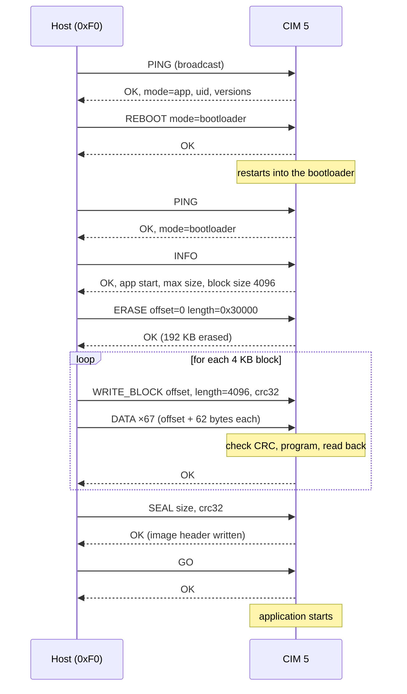

# CIM protocol

- **Status:** Draft, protocol version 2
- **Decision:** [ADR 0002](../adr/0002-device-protocol.md)

The CIM protocol lets a host (usually a PC through a CIM acting as USB adapter) find CIMs on a CAN FD bus, reboot them and update their firmware. Both the bootloader and the application implement it.

Every CIM has a **fixed address**, stored in its flash configuration. The address is written once when the board is commissioned, over USB or SWD, not over this protocol.

Version 1 is the *CAN Shell* protocol from the master thesis ([bluuas/cim-mt](https://github.com/bluuas/cim-mt), `tex/chapters/design.tex`, section *CAN Shell Message Format*). Version 2 keeps its concept and flow; the changes are listed in [section 8](#8-changes-from-version-1).

## 1. Frames and IDs

All frames are **CAN FD with bit rate switch and 29-bit IDs**. Shorter payloads are padded with `0x00` up to the next valid CAN FD length; receivers ignore the padding. Multi-byte values are **little-endian**.

```
29-bit CAN ID = 0x1C000000 | TYPE << 16 | DST << 8 | SRC

bits 28..24  0x1C           priority prefix (lowest priority)
bits 23..16  TYPE           0xC0 request, 0xC1 response, 0xC2 data
bits 15..8   DST            destination address
bits  7..0   SRC            source address
```

| Address | Meaning |
|---|---|
| `0x00` | invalid: no address configured. A CIM without an address does not take part in the protocol. |
| `0x01`–`0xEF` | CIM nodes |
| `0xF0`–`0xFE` | hosts (`0xF0` = default PC tool) |
| `0xFF` | broadcast (destination only) |

Examples with the host at `0xF0` and a CIM at `0x05`:

| Frame | CAN ID |
|---|---|
| request to CIM 5 | `0x1CC005F0` |
| response from CIM 5 | `0x1CC1F005` |
| data to CIM 5 | `0x1CC205F0` |
| broadcast request | `0x1CC0FFF0` |

## 2. Requests and responses

```
request:   [0] command  [1] seq  [2..]  arguments
response:  [0] command  [1] seq  [2]    status  [3..] data
```

- `seq` is chosen by the host, usually incremented per request. The CIM copies it into the response, so the host can match responses to requests.
- **Every request addressed to a single CIM gets exactly one response.** Broadcast requests are answered only where the command says so.
- A CIM ignores frames whose destination is neither its own address nor `0xFF`.

### Status codes

| Code | Name | Meaning |
|---|---|---|
| `0x00` | OK | |
| `0x01` | UNKNOWN_COMMAND | command not implemented |
| `0x02` | BAD_ARGUMENT | wrong length or invalid value |
| `0x03` | BAD_RANGE | address range outside the application area |
| `0x04` | BAD_STATE | not allowed now, e.g. a bootloader command sent to the application |
| `0x05` | CRC_MISMATCH | checksum does not match |
| `0x06` | FLASH_ERROR | erase or program failed, or read-back differs |
| `0x07` | TIMEOUT | expected data frames did not arrive |
| `0x08` | NO_VALID_APP | no valid application image to boot |

## 3. Commands

✓ = implemented by the bootloader (BL) or the application (App).

| Cmd | Name | BL | App | Arguments | Response data |
|---|---|---|---|---|---|
| `0x01` | PING | ✓ | ✓ | none | version u8, mode u8 (0 = app, 1 = bootloader), uid u64, firmware version u32 |
| `0x03` | REBOOT | ✓ | ✓ | mode u8 (0 = app, 1 = bootloader) | none |
| `0x10` | INFO | ✓ | | none | app start u32, app max size u32, block size u16, bootloader version u32 |
| `0x11` | ERASE | ✓ | | offset u32, length u32 | none |
| `0x12` | WRITE_BLOCK | ✓ | | offset u32, length u16, crc32 u32 | on TIMEOUT: first missing offset u16 |
| `0x13` | SEAL | ✓ | | size u32, crc32 u32 | none |
| `0x14` | GO | ✓ | | none | none |
| `0x20`–`0x2F` | *reserved: configuration* | | | | |

Offsets are relative to the start of the application area. ERASE and WRITE_BLOCK offsets must be multiples of the block size (4096 bytes, one flash sector).

- **PING**
  - May be sent as broadcast; every CIM answers. Responses do not collide, because each CIM sends with its own address as source, so every response has a different CAN ID.
  - Two CIMs configured with the same address are a configuration error. Their simultaneous responses would collide on the bus. The UID in the response helps to find such duplicates.
- **REBOOT**
  - The CIM sends the response, then reboots.
- **ERASE**
  - The response is sent after the erase has finished.
- **WRITE_BLOCK**
  - Directly after the request, without waiting, the host sends the block as data frames (section 4).
  - When all bytes have arrived, the CIM checks the CRC32, programs the flash, reads it back and responds. A gap of more than 100 ms between data frames ends the block with TIMEOUT.
- **SEAL**
  - Computes the CRC32 over the first `size` bytes of the application area. If it matches, the CIM writes the image header that marks the application as valid ("seal").
- **GO**
  - Responds OK and starts the application, or responds NO_VALID_APP.

## 4. Data frames

```
data frame:  [0..1] offset within the block u16   [2..63] up to 62 data bytes
```

A 4 KB block takes 67 data frames, and the last one is partially filled. The CIM knows the block length from WRITE_BLOCK. It accepts frames in any order and tracks which offsets it has received.

## 5. Checksum

CRC-32 (IEEE 802.3, as used by zlib), with initial value `0xFFFFFFFF` and final XOR `0xFFFFFFFF`.

## 6. Timeouts (host side)

| Request | Timeout |
|---|---|
| default | 100 ms |
| ERASE | 500 ms per 4 KB block |
| WRITE_BLOCK | 500 ms after the last data frame |
| SEAL | 2 s |

## 7. Example: updating CIM 5



## 8. Changes from version 1

Version 1 (*CAN Shell*, master thesis) and version 2 cannot talk to each other. Version 2 uses only 29-bit IDs, so both can share a bus during a migration.

| | Version 1 (CAN Shell) | Version 2 | Reason |
|---|---|---|---|
| CAN ID | one 11-bit ID (`0x101`) for all messages | 29-bit, with type, destination and source in the ID | separate request/response IDs, hardware filtering on the own address, no 11-bit IDs taken from the team DBC |
| Header | 4 bytes in the payload: source, destination, response flag, command, end flag, length | addresses and type in the CAN ID; payload starts with command and `seq` | more payload per frame, responses can be matched to requests |
| Errors | `ERROR` command, or no response at all | status byte in every response, 9 codes | no silent failures |
| Large data | `BL WRITE` up to 1 KB, split over frames with `end_flag` | `WRITE_BLOCK` of 4 KB (one flash sector), data frames carry their offset | frames can arrive in any order, missing data is detected, one round trip per sector |
| Synchronisation | `BL SYNC` stage | merged into `PING` (response includes app or bootloader mode) | one command less |
| `BL SEAL` | flash address, size, CRC32 | `SEAL`: size, CRC32 | the application start address is fixed |
| `BL GO` | start address as argument | `GO`: no argument | the application start address is fixed |
| `SHELL`, `ERROR` | defined | removed | shell was never implemented; errors are status codes now |
| Version | none | in the `PING` response | allows future changes |
| Address checks | none (`BL WRITE` could overwrite the bootloader) | offsets relative to the application area, `BAD_RANGE` outside | protects the bootloader |

