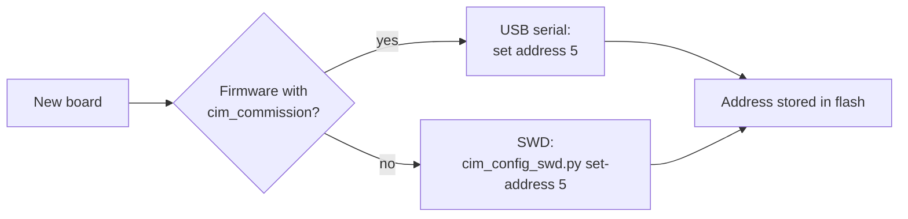

# Commissioning

Every CIM has a fixed node address ([ADR 0002](../../docs/adr/0002-device-protocol.md)), stored in the configuration ([firmware/config](../config/README.md)). It is set once when a board is commissioned.



## Over USB (normal way)

Applications offer commissioning by calling `cim_commission_poll()` regularly, e.g. in the main loop:

```c
#include "cim/commission.h"

for (;;) {
    cim_commission_poll();   /* non-blocking */
    /* ... */
}
```

Connect the CIM over USB and open its serial port with any terminal (e.g. `picocom /dev/ttyACM1`, or PuTTY on Windows). Each command is one line; every answer starts with `ok` or `error`:

| Command | Answer |
|---|---|
| `help` | list of commands |
| `info` | `ok address=5 name=pedalbox uid=E6614103E7452D2F` |
| `uid` | `ok uid=E6614103E7452D2F` (64-bit flash unique ID) |
| `get address` | `ok address=5` (0: not configured) |
| `set address <1..239>` | `ok address=5` |
| `get name` | `ok name=pedalbox` |
| `set name <text>` | `ok name=pedalbox` (1..32 printable characters) |
| `reboot` | restart the firmware |
| `reboot bootsel` | restart into the USB bootloader (drag & drop a UF2) |

The example [examples/commission](../examples/commission/main.c) shows the state on the LED: blinking red without an address, green with one.

## Over SWD (fallback)

For boards without working firmware, use [tools/cim-config](../../tools/cim-config/README.md) with a debug probe.
