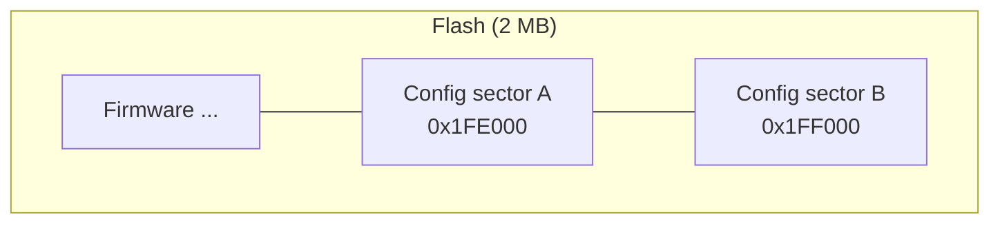
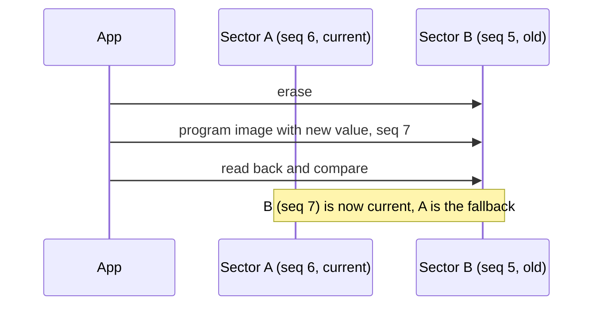

# Configuration store

Persistent key/value configuration in flash (`cim/config.h`), e.g. the node address on the CAN bus ([ADR 0002](../../docs/adr/0002-device-protocol.md)) and application values such as calibration data.

```c
#include "cim/config.h"

uint8_t address = cim_config_get_u8(CIM_CONFIG_KEY_ADDRESS, 0);   /* 0: not configured */
cim_config_set_u32(CIM_CONFIG_KEY_APP_FIRST + 0, 1234);          /* written to flash */
```

## Flash layout

The configuration uses the **last two sectors** of the flash (4 KB each). On a 2 MB flash that is offset `0x1FE000`, at address `0x101FE000` in the XIP window. Override with `CIM_CONFIG_FLASH_OFFSET`.



## How it works

- Each sector holds one complete **image**: a 16-byte header (magic `CIMC`, format version, payload length, sequence number, CRC-32) followed by records `{u16 key, u8 length, value}`.
- **Reading** picks the valid image with the highest sequence number. It reads directly from memory-mapped flash and needs no initialisation, so the bootloader can use it as well.
- **Writing** builds a new image with the changed key and writes it to the *other* sector, with a sequence number one higher. If power is lost during the erase or the write, the previous image is still intact and remains in use.
- Writing the same value again does nothing.



## Keys

| Range | Use |
|---|---|
| `0x0001` | `CIM_CONFIG_KEY_ADDRESS`, u8, node address |
| `0x0002` | `CIM_CONFIG_KEY_NAME`, string, node name |
| `0x0003`–`0x7FFF` | reserved for the platform |
| `0x8000`–`0xFFFE` | applications (`CIM_CONFIG_KEY_APP_FIRST`) |

Values are at most 255 bytes; one image holds up to 4080 bytes of records.

## Limits

- Every change erases one sector. Flash sectors are rated for about 100 000 erase cycles, so write on configuration changes, not periodically (e.g. not every second).
- Writing pauses the other core and disables interrupts for the duration of the erase and program (`flash_safe_execute()`, typically 30–50 ms).

## Tests

Host tests with a RAM flash mock, including simulated power loss: `firmware/tests/host/test_config.c`.
