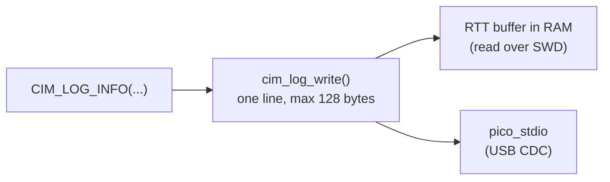

# Logging

Logging with levels and a compile-time filter, to USB CDC and RTT. No external library.

```c
#define CIM_LOG_TAG "tcan"   // optional, before the include
#include "cim/log.h"

cim_log_init();              // once at startup, after stdio_init_all()
CIM_LOG_INFO("bus on, %u kbit/s", rate);
```

```
[    12.345] I tcan: bus on, 500 kbit/s
```

## Levels

| Macro | Letter | Use for |
|---|---|---|
| `CIM_LOG_ERROR` | `E` | something failed |
| `CIM_LOG_WARN` | `W` | unexpected, but handled |
| `CIM_LOG_INFO` | `I` | state changes, startup |
| `CIM_LOG_DEBUG` | `D` | details for development |

`CIM_LOG_LEVEL` (default `CIM_LOG_LEVEL_INFO`) sets the highest level that is compiled in. Calls above it are removed by the compiler and their arguments are not evaluated. Set it per target:

```cmake
target_compile_definitions(my_app PRIVATE CIM_LOG_LEVEL=CIM_LOG_LEVEL_DEBUG)
```

## Outputs



Both outputs get every line. Neither blocks without a reader: RTT drops the line when its buffer is full, USB CDC drops output when no host is connected.

| Output | How to read | Settings |
|---|---|---|
| USB CDC | any terminal on the CIM's serial port, e.g. `picocom /dev/ttyACM0`. The application enables it with `pico_enable_stdio_usb(<target> 1)`. | `CIM_LOG_USB=0` turns it off |
| RTT | a debugger over SWD, without USB. With OpenOCD: see below. | `CIM_LOG_RTT_BUFFER_SIZE` (default 1024) |

RTT with OpenOCD (on the HIL Pi with `hil/openocd/slot-x.cfg`, or with a debug probe):

```sh
openocd -f hil/openocd/slot-b.cfg \
    -c init -c 'rtt setup 0x20000000 0x40000 "SEGGER RTT"' -c "rtt start" -c "rtt server start 9090 0"
nc localhost 9090
```

`rtt setup` searches the given RAM range for the control block. To skip the search, pass the address of the symbol `cim_log_rtt` from the ELF (`arm-none-eabi-nm app.elf | grep cim_log_rtt`) with size 16.

## Notes

- Do not log from interrupt handlers: the USB output takes a mutex.
- Lines are cut at `CIM_LOG_LINE_MAX` (128 bytes) and then end in `...`. `CIM_LOG_LINE_MAX` and the output settings apply to the `cim_log` library, not per file.
- `log.c` (formatting) is platform-independent and tested on the host (`firmware/tests/host/test_log.c`). `log_pico.c` has the clock and the outputs.
- The RTT control block follows the layout debuggers expect (ID `SEGGER RTT`); the implementation is our own.
