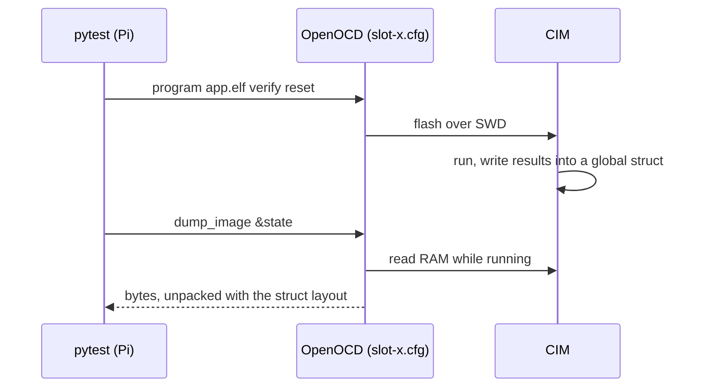

# HIL test runner

pytest tests that run firmware on the CIMs of the HIL bench. They run on the Pi: each test flashes a firmware ELF over SWD (`hil/openocd`), resets the board, and reads the firmware's results from RAM.



## Bench description

[`hil/bench.toml`](../bench.toml) says what is in each slot. A test that uses the `slot` fixture runs once per slot; empty slots and slots with a known defect are skipped with the reason from the file.

## Fixtures

| Fixture | |
|---|---|
| `slot` | `Slot` of a usable slot: `flash(elf)`, `reset()`, `read(addr, size)`, `read_var(elf, name, fmt)`, `wait_var(elf, name, fmt, predicate)`, `rtt_read(elf, seconds)` |
| `firmware` | `firmware("config_counter")` returns `<firmware-dir>/examples/config_counter/config_counter.elf`; `firmware("example", subdir="apps")` an app |

`read_var` finds the variable in the ELF's symbol table and unpacks it with a [`struct`](https://docs.python.org/3/library/struct.html) format, e.g. `"<IIi"` for `struct { uint32_t; uint32_t; int32_t; }`. Test firmware only needs to keep its results in a global variable.

During a test, its name is shown on the bench display ([hil/status-display](../status-display/README.md)).

## Run

On the Pi, from a checkout of the repository with the firmware built (or copied) to `build/cim_proto_v7-debug`:

```sh
python3 -m venv .venv && .venv/bin/pip install -r hil/runner/requirements.txt
cd hil/runner
../../.venv/bin/python -m pytest -v --junitxml=hil-report.xml
```

| Option | Default | |
|---|---|---|
| `--bench` | `hil/bench.toml` | bench description |
| `--firmware-dir` | `build/cim_proto_v7-debug` | build directory with `examples/<name>/<name>.elf` |

Write the options as `--firmware-dir=PATH`. With a space (`--firmware-dir PATH`), pytest takes `PATH` for a test path before `conftest.py` has registered the option, and fails with `unrecognized arguments`.

## Tests

| Test | Firmware | Checks |
|---|---|---|
| `test_config_counter.py` | `config_counter` | the boot counter in the config store increases by exactly 1 per reset (#9) |
| `test_tcan_probe.py` | `tcan_probe` | TCAN device ID over SPI, power-on interrupt on nINT (#5); VSUP state as JUnit property `vsup_ok` |
| `test_log.py` | `log_demo` | log lines over RTT: format, levels (DEBUG compiled out), no lost lines (#10) |
| `test_rtos.py` | `rtos_demo` | FreeRTOS: task rates, 1 kHz tick, `cim_delay_ms()` blocks instead of busy-waiting (#8) |
| `test_example_app.py` | `apps/example` | the template app starts FreeRTOS and logs a heartbeat every second (#60) |
