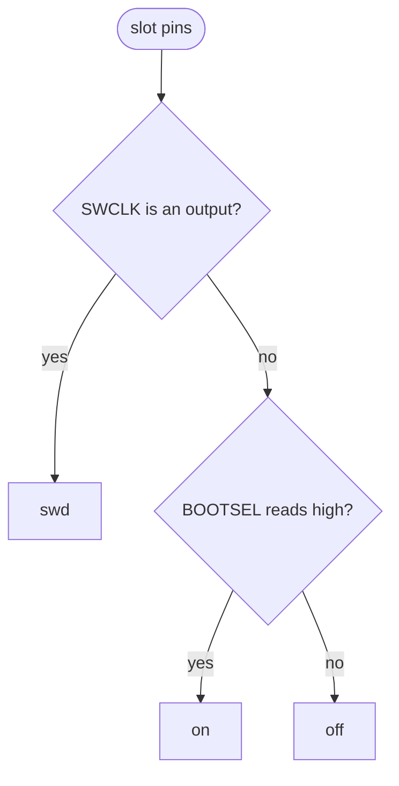

# HIL status display

Shows the bench state on the 0.91" OLED on HAT connector J4 (SSD1306, 128×32, I2C bus 1, address `0x3C`), so you can check the bench without logging in.

```
cim-hil 192.168.31.170
A off  B swd  C on
flash slot B
```

| Line | Content |
|---|---|
| 1 | hostname and IP |
| 2 | per slot: `on` (CIM powered), `off` (empty or unpowered), `swd` (OpenOCD active) |
| 3 | first line of `/run/cim-hil/status` |

## How a slot is read

The pins are read with `pinctrl get`, a plain register read. The display never requests a GPIO line, so it never blocks OpenOCD.



BOOTSEL (the CIM's QSPI_SS) has a pull-up on the CIM and a pull-down on the Pi, so it reads high only when the CIM is powered. SWDIO is not used for this, because OpenOCD leaves it without a pull and it floats afterwards.

## Install

On the Pi, as the HIL user, after [`hil/setup-pi.sh`](../setup-pi.sh) (I2C enabled):

```sh
./install.sh
```

This copies the script to `/opt/cim-hil/status-display`, creates a venv with [luma.oled](https://github.com/rm-hull/luma.oled), and installs and starts `cim-hil-status.service`. Run it again to update. The service keeps running without a display and picks it up when it appears; on `systemctl stop` it clears the display.

## Writing the status line

The service creates `/run/cim-hil/` writable by the HIL user. A test runner writes one line:

```sh
echo "flash slot B" > /run/cim-hil/status
```

## Development

```sh
python3 status_display.py --print                   # lines on stdout, no display needed
python3 status_display.py --status-file status.txt  # display, own status file
python3 -m pytest test_status_display.py
```
